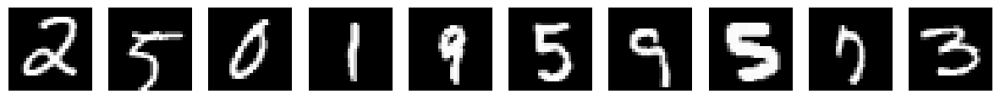
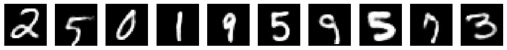
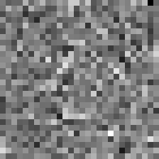

# Generative Models from Scratch — VAE & DDPM

Implementing generative models from scratch in PyTorch — Variational Autoencoder (VAE) and Denoising Diffusion Probabilistic Model (DDPM) trained on MNIST.

---

## Models

### Variational Autoencoder (VAE)
A VAE learns to compress images into a structured latent space and reconstruct them back. Unlike a regular autoencoder, the latent space is continuous — allowing us to generate new images by sampling random points.

**Architecture**
- Encoder: 784 → 512 → 256 → latent (μ, σ)
- Decoder: latent → 256 → 512 → 784
- Latent dimension: 16

**Results**

| Original | Reconstructed |
|----------|--------------|
|  |  |

---

### Denoising Diffusion Probabilistic Model (DDPM)
DDPM learns to reverse a gradual noising process — starting from pure random noise and denoising step by step to generate new images.

**Architecture**
- U-Net with sinusoidal timestep embeddings
- Linear noise scheduler (β: 0.0001 → 0.02)
- 1000 diffusion timesteps

**Generation Process**



---

## Tech Stack
Python, PyTorch, NumPy, Matplotlib, Jupyter Notebook

---

## How to Run

1. Clone the repo
```bash
   git clone https://github.com/NAVANEETH-SHENOY/Generative-models-pytorch.git
```

2. Install dependencies
```bash
   pip install torch torchvision numpy matplotlib imageio
```

3. Run the notebooks
   - `VAE.ipynb` — train and evaluate the VAE
   - `ddpm.ipynb` — train and generate images with DDPM

---

## Key Concepts Implemented
- Reparameterization trick
- KL divergence loss
- Sinusoidal timestep embeddings
- Forward and reverse diffusion process
- U-Net with skip connections
